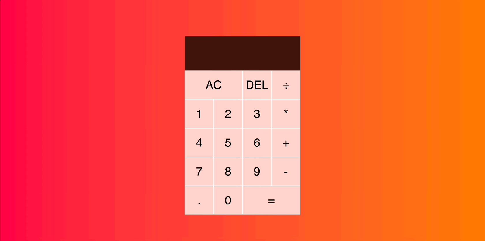

<h1>javaScript Calculator Project.</h1>

A project where i created a javaScript calculator with some HTML&CSS styling.

<h2>What is used to make this project happened</h2>

Created a base HTML body and styled it with CSS. After that added javaScript and also the "math" logic to create the calculator

<h2> Screen gif of final result</h2>

